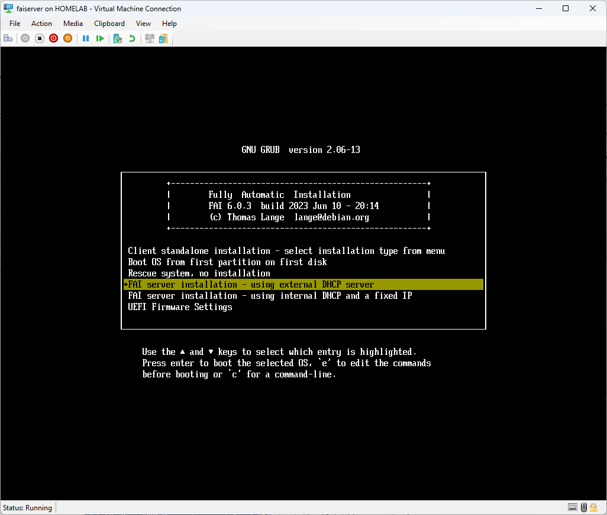
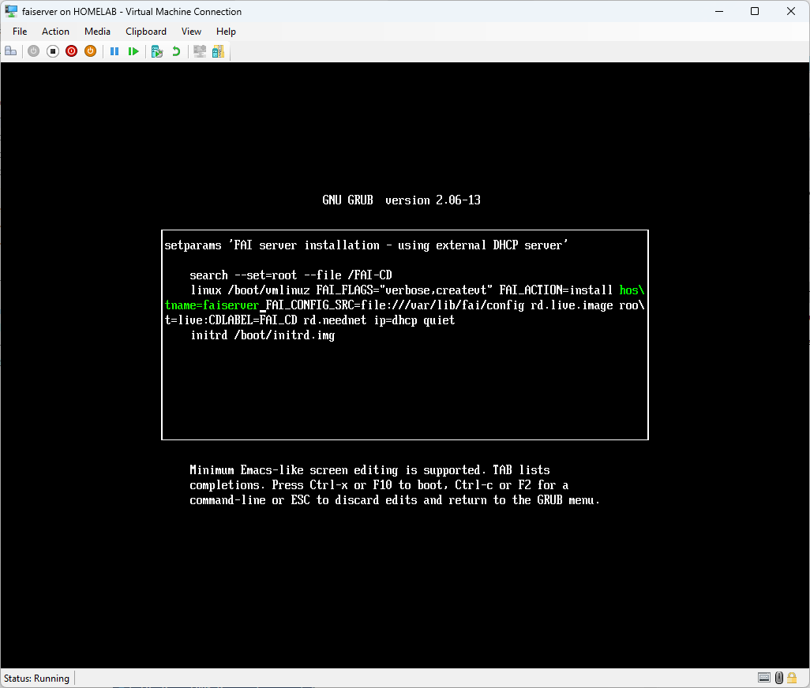
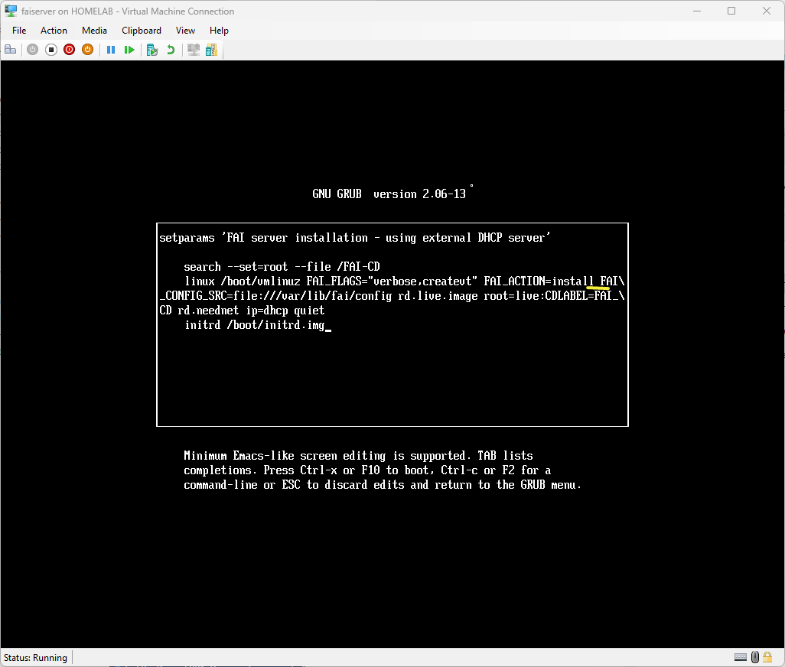
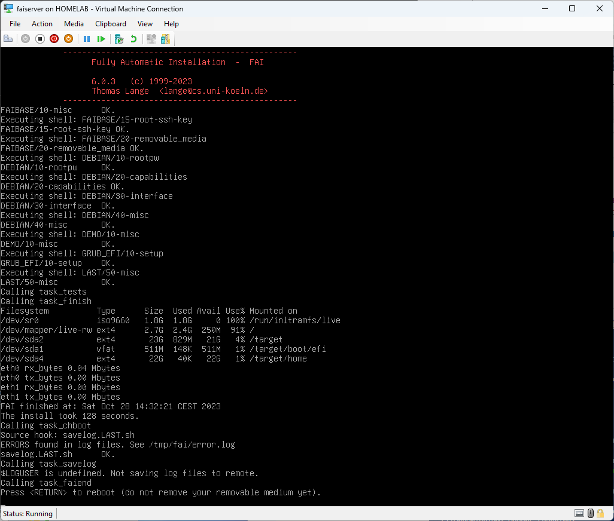
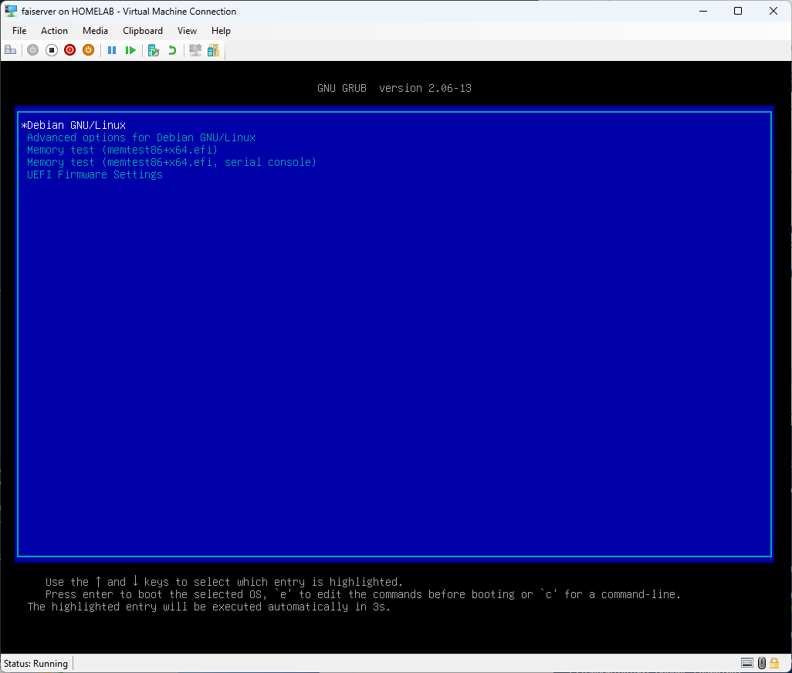
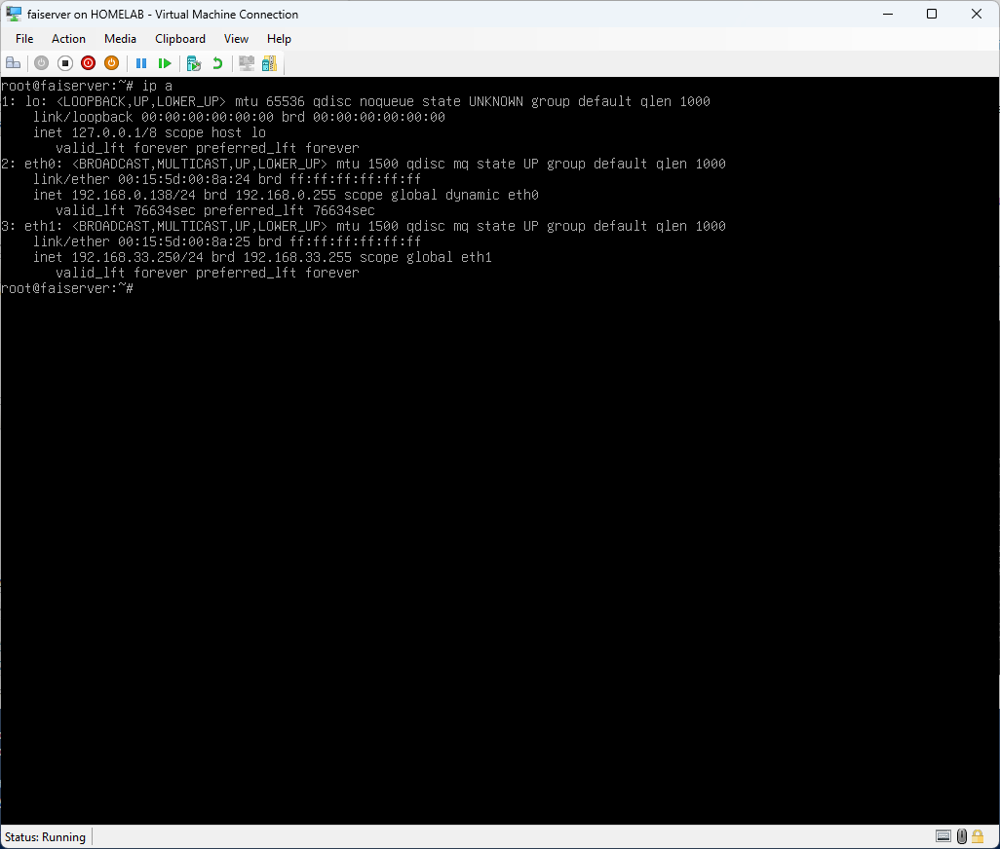
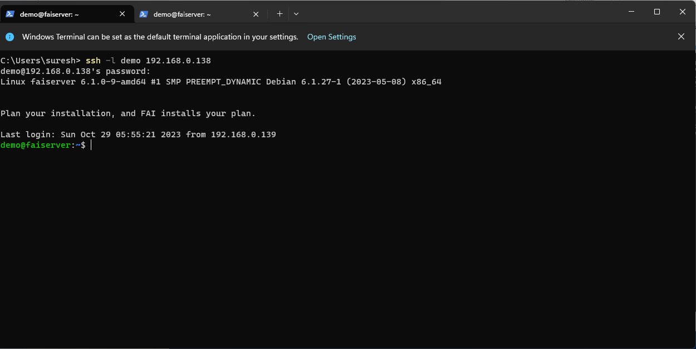

# FAISERVER server

## Start the faiserver on Hyper-V
At the faiserver boot menu select 
**"FAI server installation - using external DHCP server"**




In order to make the installtion work you need to edit this entry.

press [e] to edit the entry
remove the entry "hostname=FAISERVER"
there is a bug that fails if this edit is not done.



After the edit



Once removed press [Ctrl X] to boot up the installer.
if you press [esc] the changes made will be canceled the the installation will not boot correctly.

#### FAI Server setup completed.
It took about  128 seconds for me.

press enter to reboot.

#### Boot Sequence will be changed by setup
The installer will change the boot sequence to list the Hard Disk as primary option. 

#### Boot screen on reboot


#### Default credentials
These are the default passwords
```
login : root <will not work via ssh>
login : demo  <remote ssh use this id>
login : fai  <to be created manually>
password :fai 
```

### Initial changes after setup
Upon completion we have to tweak some changes . Here are the changes.

If you did not confgure DHCP to assign the IP via MAC address. You have to set the IP address with the following steps.
skip if the IP is already assigned with 192.168.33.250/24.

- IP address for eth0 (private)
```
edit /etc/network/interfaces.d/eth1
vi /etc/network/interfaces.d/eth1
# Manualy type in the following
# press [i] to be in insert mode


auto eth0
iface eth0 inet static
    address 192.168.33.250/24
    gateway 192.168.33.1 
	nameserver 192.168.33.1

[esc] :x [enter] to save and exit.

```

### Validate the IP configuration 
```
check with `ip a` 
```

[Reference to not configure multpile gateways](https://blog.karssen.org/2013/03/28/solving-rtnetlink-answers-file-exists-when-running-ifup/)


### Connecting via ssh
Steps to ssh.
- Identify the IP address  type `ip a` at the prompt.





- Use a terminal client. Putty is a good terminal to use. Windows 11 as a Terminal client installed I will be trying that in this example.But any terminal program can be used.
As per the previous `ip a` screenshot
``````
eth0 : is assigned with IP  192.168.33.250
``````

Using Windows Terminal to ssh
```
ssh -l demo 192.168.33.250
```



### Hostname change , disable ipv6 and create user "fai"

Now with a terminal ssh session you can copy and paste.

As you would have logged on as demo , the current shell needs elevated rights.
Enter the command below and type in the password , it should be "fai"

Elevate rights to sudo
```
su -l 
```
#### Change the hostname

```
echo "faisvr" |  tee  /etc/hostname
```

#### create user fai
```
adduser fai
usermod -aG sudo fai

```

allow root login remotely
```
vi /etc/ssh/sshd_configvi /etc/ssh/sshd_config
#update following row
PermitRootLogin yes

systemctl status sshd
systemctl restart sshd
```
# fix up down arrow in vi
```
vi ~/.vimrc
set nocompatible
echo "set nocompatible" |  tee -a ~/.vimrc

```
We are now done with the faiserver setup, we will move on to the faiserver Application setup.

Move on to 
[102-faiserver-application-setup](./102-faiserver-application-setup.md)


