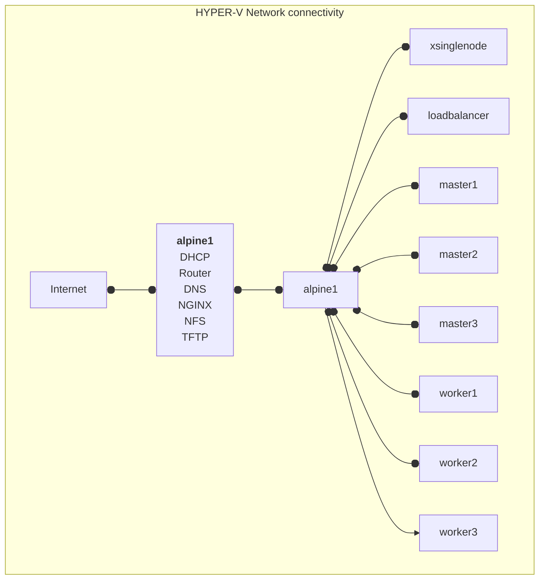

# Kubernetes lab setup - High level reference.

| hostname | IP address |
| ----------- | ----------- |
| alpine1 | 192.168.100.1/24 |
| Hyper-V-Host | 192.168.100.2/24 |
|xsinglenode|192.168.100.199/24 |
| loadbalancer | 192.168.100.201/24 |
| master1 | 192.168.100.202/24 |
| master2 | 192.168.100.203/24 |
| master3 | 192.168.100.204/24 |
| worker1 | 192.168.100.205/24 |
| worker2 | 192.168.100.206/24 |
| worker3 | 192.168.100.207/24 |
| metallb | 192.168.100.208-215 |

`alpine1` functions for the devices in the subnet `192.168.100.0/24` as 
- DHCP server 
- Internet Router This server has 2 NIC one for the Internet access and another on the subnet `192.168.100.0/24`
- DNS
- NGINX web server
- (removed)NFS server
- TFTP server
- Hosting the various files required for the Ubuntu and Kubernetese setup

`xsinglenode` Is a single node implementation of Kubernetes.

`loadbalancer` functions as the entry point to the Master nodes, performing the High Availability fucntions for the multiple Master nodes.

`master1/2/3` This is the Kubernetes Control plane. Acting as a High Availability setup that allows for 1 Master node failure at any time.

`worker1/2/3` The Kubernetes workloads are deployed on these nodes. 3 nodes allow for some load balancing in the event nodes need to be taken down for maintenance purposes.

`metallb` The Ingress requires a set of IP addresses to cater for incoming traffic to the Kubernetes cluster. These IP ranges are reserved for this functionality.

#### High Level Network Diagram

HYPER-V Network connectivity
All the VM's will use `alpine1` as the gateway to the internet.
Apart from the gateway function, `alpine1` also acts as performs several other functions. 

