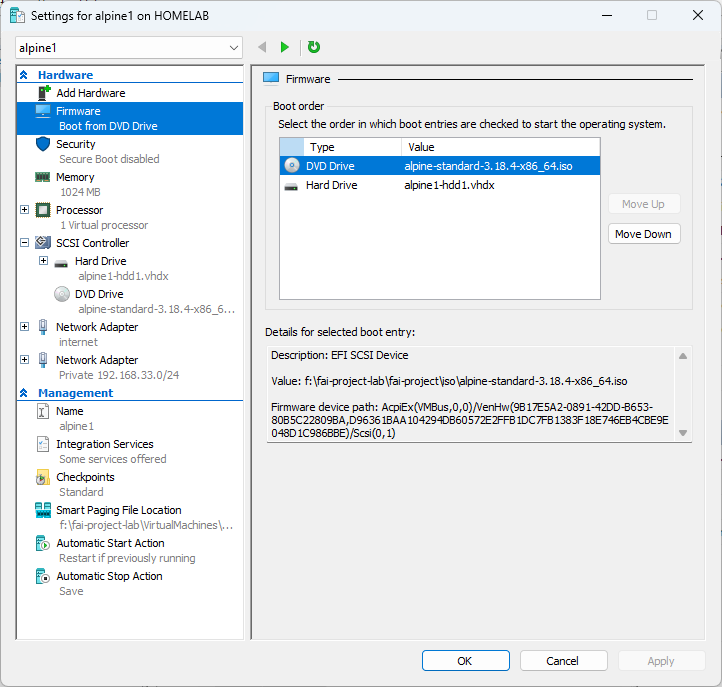
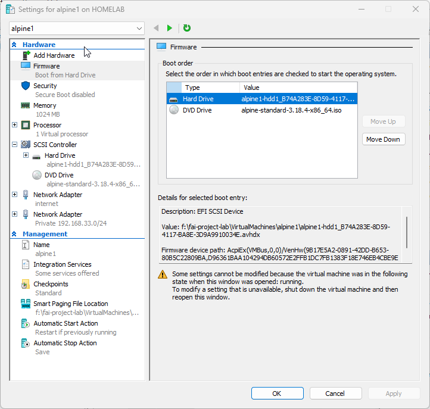
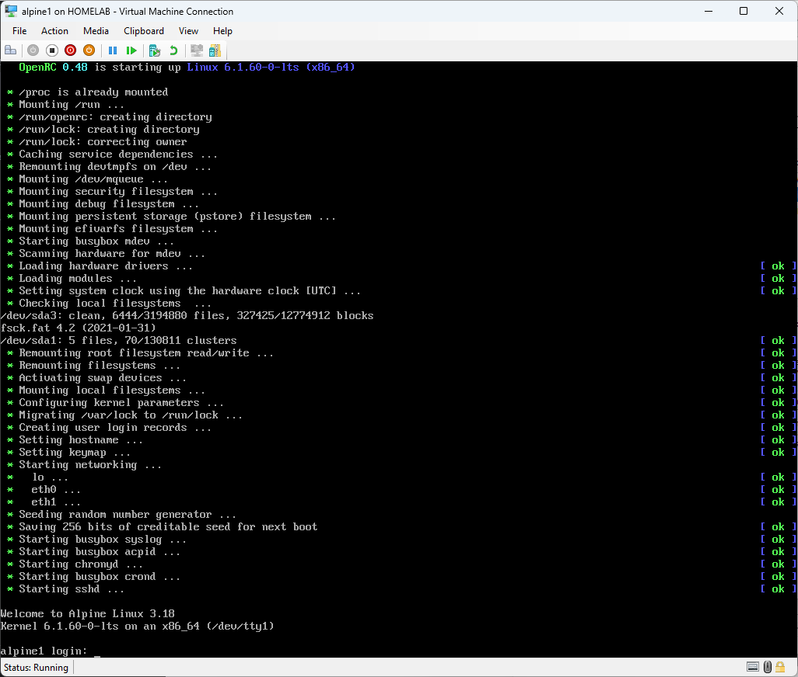

## Initial Alpine OS setup

## Key information
```
Alpine Default login
login : root
password : blank
```
## Hyper-V configuration for reference



## Alpine install ISO first boot


## Disable IPv6 on Alpine 
In my setup IPv6 was not working.When downloading files IPv6 was used and delayed/errored out.
If you have issues with IPv6, do disable before proceeding. 

 Edit the /etc/sysctl.conf

```
vi /etc/sysctl.conf
# Manualy type in the followingf
# press [i] to be in insert /edit mode

net.ipv6.conf.all.disable_ipv6 = 1
# to save and exit following key press
# [esc] :x! [enter]

# reload the configuration
sysctl -p
```

## Install Alpine 
After logging on at the prompt type 
``` 
setup-alpine
```
You will be asked a series of questions . I have listed my selection.
```
Keyboard Layout : [us]
Keyboard variant : [us]
Hostname : [alpine1]
Network :
eth0: [dhcp]  # Internet connection
eth1: [192.168.100.1/24]
gateway: [none]
password : [123]
DNS Servers :
Timezone :[Singpore]
Proxy :[none]
ntp: default [chrony]  #if it takes long to complete , make sure ipv6 is disabled
Mirror :[f] # Detect and add fastest mirror
setup user : [no]
Which ssh server? [openssh]
allow root ssh login: [yes]
Allow ssh login : [yes]
Which disks would you like to use : [sda]
Disk Mode How would you like to use it ? [sys]
Erase the above disks and continue? [y]
```

## Installation begins.
Once the installation is completed you will see the notice to reboot.
Before rebooting, change the boot sequence in Hyper-V for alpine1 to be Hard Drive first.

This will ensure the reboot will be to the Hard Disk.

On the apline1 Hyper-V console.
the prompt will display press [enter]
```
installation complete type reboot [enter]
```

## Setup completed 


These are the credentials for newly installed alpine1 . 
```
login: root
pass: 123
#in this lab all passwords will be set with 123
```
This screen will appear , take note of the login prompt **'alpine1'**. Indicating the installation is completed.


## Connect via ssh
If you don't already know the Hyper-V console is not able to perform copy and paste operations. Via a terminal connection copy and paste functions make it easier to paste commands , especially the long ones.
At this time the Hyper-V host does not have an IP in the `Private Subnet 192.168.100.0/24` . We cannot test the SSH at this time.
We can test this when DHCP is setup later on.


# Alpine OS install completed 


## Next step

We will proceed to setup alpine1 as a DHCP server 

Please continue with 

### 101-alpine1-setup-DHCP-server
