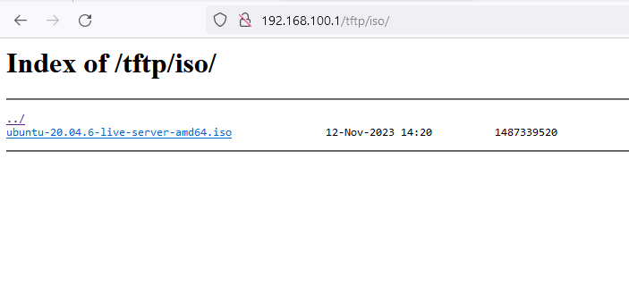
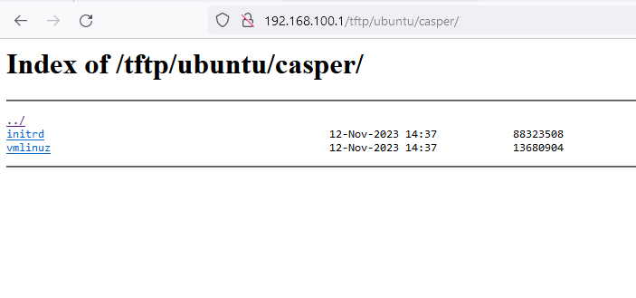

## Setup OS Boot files

In this section we will perform 2 tasks 
- Download and mount the ISO Live CD.
- Extract the `vmlinuz` and `initrd` files from the LiveCD to the tftp folder

## Step 1 Download and Mount the ISO.

## 

```
# lets host the ISO in the folder /iso
mkdir -p /srv/tftp/iso
# Download the ISO
[ ! -f /srv/tftp/iso/ubuntu-20.04.6-live-server-amd64.iso ] && wget -P /srv/tftp/iso https://releases.ubuntu.com/20.04.6/ubuntu-20.04.6-live-server-amd64.iso

# Create mount folder 
mkdir -p /srv/isoubuntu

# mount the ISO to view contents.
mount -o loop,ro -t iso9660 /srv/tftp/iso/ubuntu-20.04.6-live-server-amd64.iso /srv/isoubuntu
# list content to validate
ls /srv/isoubuntu

```


#### Step 2 Extract `vmlinuz` and `initrd`

Run the commands below to extract the boot files.

```
#create ubuntu folder to store the boot files.
# this way we can have boot files for multple distros if required.
mkdir -p /srv/tftp/ubuntu/casper

# copy files
cp  /srv/isoubuntu/casper/vmlinuz /srv/tftp/ubuntu/casper
cp  /srv/isoubuntu/casper/initrd /srv/tftp/ubuntu/casper
```

**Validate**
The boot files will be served via http. Do validate if this folder and content is listed.


 


**Validate if accessible via HTTP** 

As we have already setup `nginx` to list directory content. This should be visible via browser.


Click `tftp` and `iso` to list the ISO LiveCD.



## Step 2 Extract `vmlinuz` and `initrd`

### Boot files.

When booting a Server with Linux, there are 2 files required.
`vmlinuz` and `initrd` at times the version is part of the name depending on Linux flavors

In this example boot files are retrieved from `ubuntu-20.04.6-live-server-amd64.iso`


Run the commands below to extract the boot files.

```
#create ubuntu folder to store the boot files.
# this way we can have boot files for multple distros if required.
mkdir -p /srv/tftp/ubuntu/casper

# copy files
cp  /srv/isoubuntu/casper/vmlinuz /srv/tftp/ubuntu/casper
cp  /srv/isoubuntu/casper/initrd /srv/tftp/ubuntu/casper
```

**Validate**
The boot files will be served via http. Do validate if this folder and content is listed.


 


 ## Next step

At this stage we have made all the required files available for the boot process.
Next we will put in the final piece for the setup to function.
### 111-setup-boot-files-part3-pxelinux.cfg