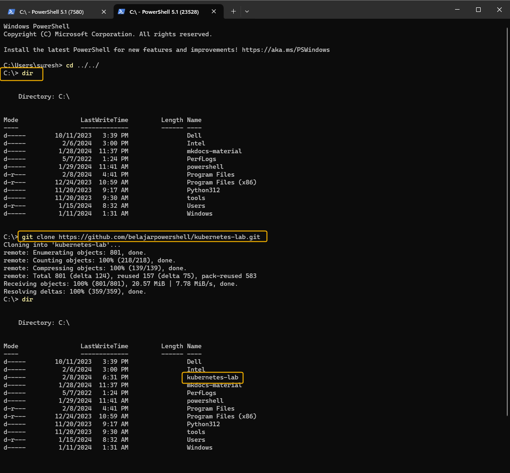

# Clone Repository

The scripts required to perform the various tasks are located in the git repository  https://github.com/belajarpowershell/kubernetes-lab

You will need to have GIT installed [Install Git ](https://git-scm.com/download/win) 

On Windows 11 you can open a `Terminal`  that can run the `git' commands. 

The following command will create a folder `kubernetes-lab` and download the files.

```
# change to the Drive you want to store the files before executing this.
git clone https://github.com/belajarpowershell/kubernetes-lab.git
```




The files can then be found in ( in this example its the c:\ drive it might be different for you.)

```
c:\kubernetes-lab
```

