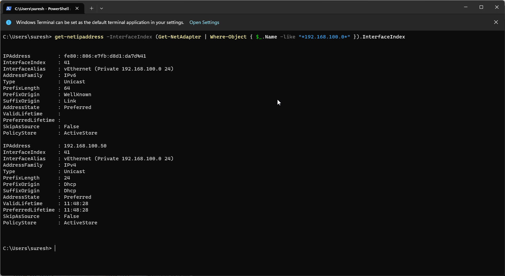
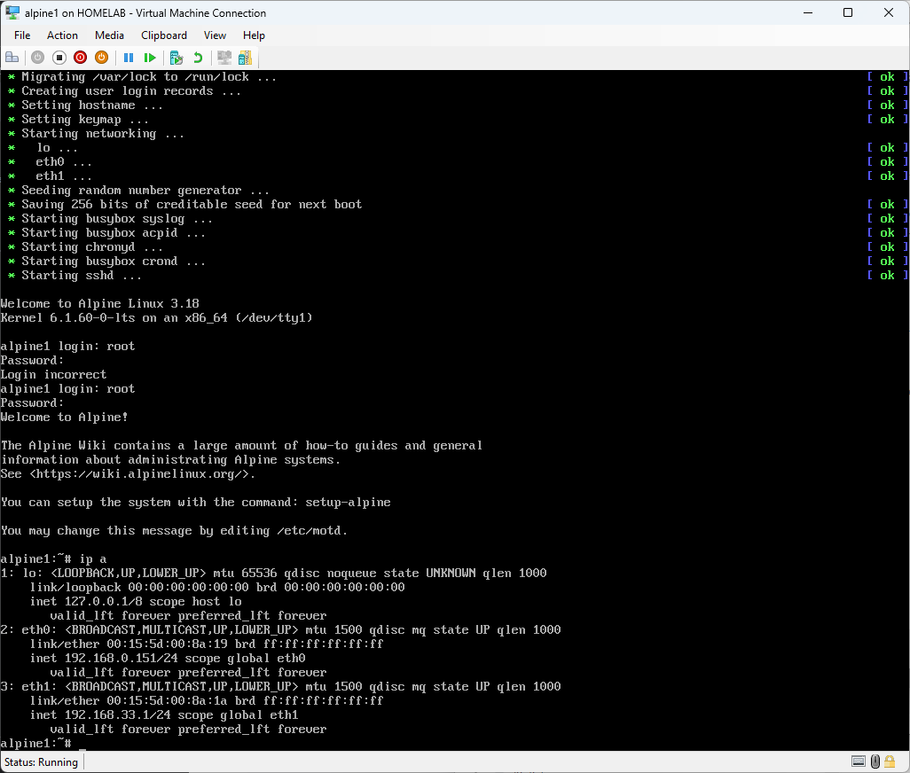
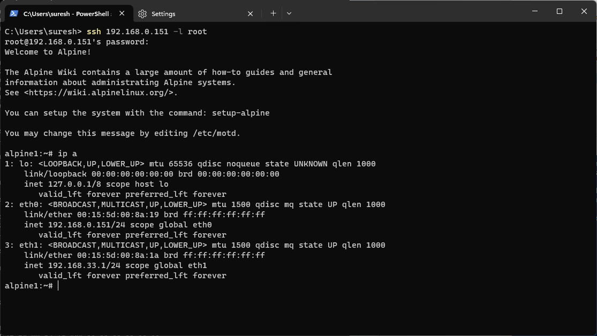

# Install and Configure DHCP

For the initial setup we will have the basic DHCP configuration.

```
#install dhcpd
apk add dhcp
```

Update the file /etc/dhcp/dhcpd.conf with the content below.

Use VI editor to edit ( or any other you are familiar with)
```
# using console you cannot copy paste, must type in manually
# create config file 
touch /etc/dhcp/dhcpd.conf
# edit config file
vi /etc/dhcp/dhcpd.conf

subnet 192.168.100.0 netmask 255.255.255.0 {
  range 192.168.100.100 192.168.100.200;
  option domain-name-servers 192.168.100.1;
  option routers 192.168.100.1;
}
[esc] :x[enter] to save and exit
```
> routers : The routers IP usually is the WIFI or WAN router IP. In this lab setup we want emulate an office network setup.
> In the subsequent steps we will review how to setup alpine1 as a Router.

> domain-name-servers : in this setup we want to resolve some internal hostnames  that cannot be resolved by public DNS servers.
> We want to have alpine1 to function as DNS server and also forward DNS request not resolved locally.
> The steps to configure alpine1 as DNS server is reviewed later.

## Restart the DHCP deamon
To refresh the updated configuration restart the DHCP services.
Any errors in configuration will appear at this point.
```
# set dhcpd to start at boot
rc-update add dhcpd default

# start the dhcpd service.
rc-service dhcpd start

# Check the dhcpd service status.
rc-service dhcpd status

```
DHCP logs
Later you may need to check if the IP addresses are assigned etc.
These to files will be key for your troubleshooting.
```
cat /etc/dhcp/dhcpd.conf
cat /var/lib/dhcp/dhcpd.leases
```

## DHCP Setup is complete  for alpine1 server .

## Steps to ssh.

If using DHCP, the gateway is also assigned to my Hyper-V host Network Interface.
This caused some network issues where my connection to the internet kept timing out. When I set the IP address without the Gateway the network issues were no longer present. 
So better to set the IP address manualy then obtain via DHCP.

Paste the following Powershell code int Windows Terminal as Administrator.

```
$ifindex=(Get-NetAdapter | Where-Object { $_.Name -like "*192.168.100.0*" }).InterfaceIndex
New-NetIPAddress -InterfaceIndex $ifindex -IPAddress 192.168.100.2 -PrefixLength 24
Get-DnsClient -InterfaceIndex $ifindex | Set-DnsClientServerAddress -ServerAddresses ("192.168.100.1")

```
Validate

Run this command on Windows Terminal to check if an IP has been assigned
```
get-netipaddress -InterfaceIndex (Get-NetAdapter | Where-Object { $_.Name -like "*192.168.100.0*" }).InterfaceIndex
```


Troubleshooting.
- If that is working, then review the IP address ranges assigned to ensure they are correct and check for typos in the IP address.
- Ensure only one gateway IP address is assigned. Having multiple gateways will introduce connectivity issues.

## How to identify the IP address on a linux machine?
At the prompt type.
```
  ip a 
```
Here is an example 


## How to SSH to a Linux Machine?

Use a terminal client.Putty is a good terminal to use.
In Windows 11 as I have Terminal client installed I will be using this lab.
But any terminal program can be used.


Back to ssh from Windows terminal
I will peform further configuration from the Windows Terminal as I will be able to copy and paste commands.

From Windows Terminal type the following command. You will be presented with a login request.

```
ssh -l root 192.168.100.1
Password : `123` # if the proposed Password was used
```



# DHCP is installed and SSH to `alpine1` server established.

## Next step

We will proceed with the router installation. 

The validation for DHCP and Internet on the private network will be tested at a later stage.

Please continue with 
### 102-alpine1-setup-route
