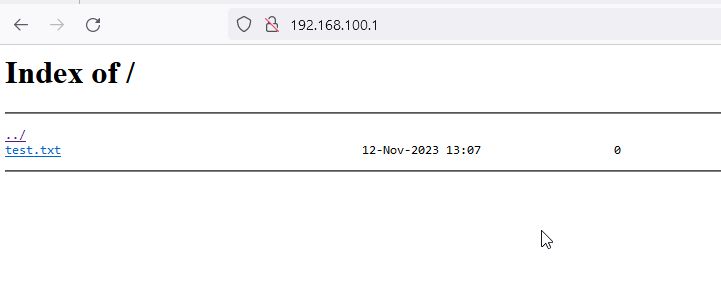

# Install and Configure Nginx
A webserver is handy for several reasons. In this Lab we will use a webserver for quite a bit of stuff. Lets set up `nginx` for this purpose.

```
#install nginx 
apk update
apk add nginx

# set nginx to start at boot
rc-update add nginx default

#check nginx service status
rc-service nginx status

# start nginx service 
rc-service nginx start


#nginx configuration
# no change required in this lab setup
vi /etc/nginx/nginx.conf
```

Configure a new site to list the files over http.
```
# nginx installs with a default site 
# this site will intefere with the new site we are setting up.
# remove default site
rm /etc/nginx/http.d/default.conf

# create a file for the site .

vi /etc/nginx/http.d/installfileserver.conf
# paste the following code.
server {
    server_name localhost;
    root /srv/;
    #index index.html;
    location / {  # new url path # this is the URL path on browser
  alias /srv/; # directory to list
    #in this case http://ip/ will list files in "/srv/"
  	# this might not be best practice, but this is a Lab setup 
	autoindex on;
    }

}
```

Check nginx config after every change for errors
```
#check syntax 
nginx -t

#reload nginx
rc-service nginx restart 
```
Logs
You can check the files accessed via url, this way you can validate if the correct paths are in place.

```
cat /var/log/nginx/access.log
```

Validate 

```
# create a file to be listed
mkdir -p /srv/autoinstall/ && touch /srv/autoinstall/test.txt

#In a browser open the following URL
http://192.168.100.1

The list of files hosted in `/srv/autoinstall/` will be listed.
```
Here is and example


`nginx` can also be deployed using `Docker`, I will provide the steps at a later version

### Setup `alpine1` server `nginx` is complete.


## Next step

We will proceed with the nfs server installation 

Please continue with 
### 105-alpine1-nfs
