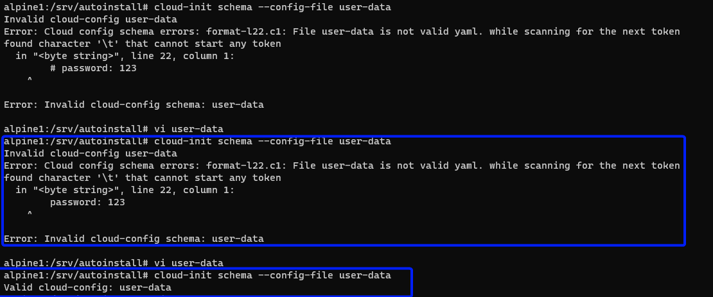

# Install and Configure cloud-init
cloud-init is the application that reads the `user-data` script as part of autoinstallation. 
As I have been having issues with my `user-data` I needed a method to validate the content.
Turns out `cloud-init` has a command for just that!


```
# enable community repository
vi /etc/apk/repositories
remove # from the row
#http://mirror.jingk.ai/alpine/v3.18/community

#install `cloud-init` 
apk update
apk add cloud-init

#setup cloud-init
setup-cloud-init
```

Validate `user-data` using the command below.
At this time the lab has not generated the `user-data`  file . 

You can test this if you have a `user-data` file handy. The `user-data` will be shared in later steps 

```
cloud-init schema --config-file user-data
```
My error was to put in an entry for remark that was not recognized. 



## Next step

We will proceed with the DHCP setup for PXE requirements. 

Please continue with 
### 108-alpine1-DHCP-for-PXE
