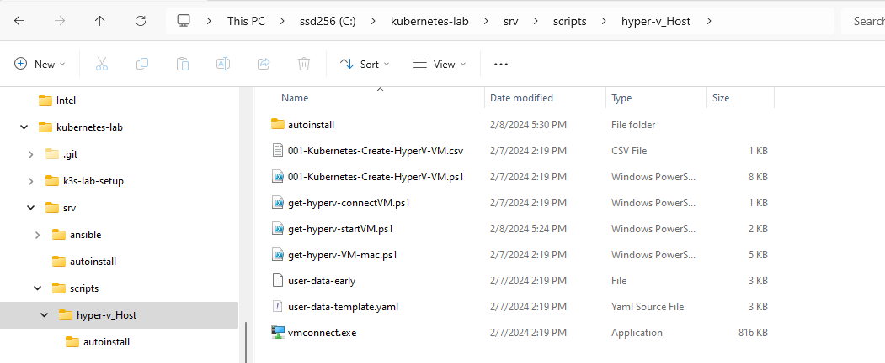
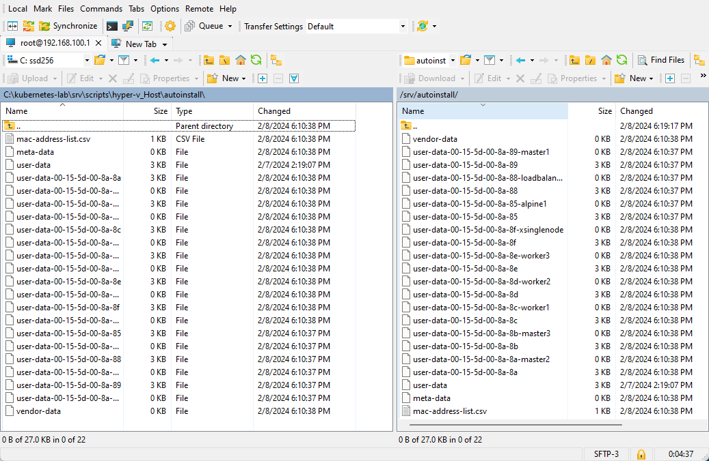

# Install Ubuntu

Step `103-setup-using-ansible` would have setup `alpine1` to perform the functions required for the Ubuntu Auto install steps.

We now have some manual tasks to create the `user-data-mac-address` file for each of the Virtual Machines created ( excluding `alpine1`)


### Step 1

#### Start and stop all the Virtual Machines created.

For the following step, the Virtual Machines created must be started once to generate the mac-address.

From PowerShell ISE  open `G:\kubernetes-lab\srv\scripts\get-hyperv-startVM.ps1`

Click on the `Green Play` button, this will execute the script.

This will start and then stop all the Virtual Machines . Ensure the Virtual Machine names are not changed. 

You can also Start and Stop from the Hyper-V Console. 


### Step 2

#### Generate user-data-mac-address file.

For a Kubernetes cluster we will need multiple Virtual Machines. This will require multiple `user-data-mac-address` files to be created. Here I use PowerShell to generate the files.

From PowerShell ISE  open `G:\kubernetes-lab\srv\scripts\get-hyperv-VM-mac.ps1`

Click on the `Green Play` button, this will execute the script.

The generated files are in the subfolder  `.\autoinstall\`




From the configuration in step 112 , the Boot sequence is looking up the location. `http://192.168.100.1/autoinstall/`

This is from the following code

```
APPEND netboot=nfs boot=casper root=/dev/nfs nfsroot=192.168.100.1:/srv/isoubuntu autoinstall 
```

Copy the files created to the folder 

` /srv/autoinstall/` on the `alpine1` server. The duplicate file with the node name is workaround to show the hostname of the specific file. As I did not find away to identify the hostname using the Ubuntu autoinstall method.





If you recall from 104-setup-nginx, the folder /srv/ was exposed to be visible from `http://192.168.100.1/`. All folders created in `/srv/` will be listed via the browser.

Copy the files using WSFTP or some other method . 

Validate by browsing `http://192.168.100.1/`


// To update Video of Script generation and the Ubuntu setup.


#### Lessons Learnt

The MAC addresses for a newly created Hyper-V VM is not generated until its started at least once. 

