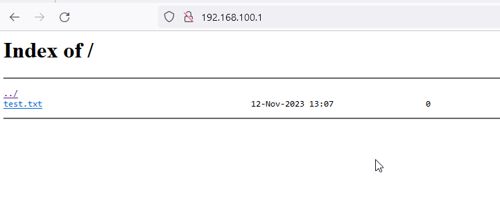

# `alpine1` setup and configuration.

## Install and Configure nginx

```
#install nginx 
apk update
apk add nginx

# set nginx to start at boot
rc-update add nginx default

#check nginx service status
rc-service nginx status

# start nginx service 
rc-service nginx start


#Nginx configuration
# no change required in this lab setup
vi /etc/nginx/nginx.conf
```


Configure a new site to list the files over http.
```
# nginx installs with a default site 
# this site will intefere with the new site we are setting up.

# remove default site
rm /etc/nginx/http.d/default.conf

# create a file for the site .
vi /etc/nginx/http.d/wwwdirectory.conf

# paste the following code.
server {
    server_name localhost;
    root /srv/;
    #index index.html;
    location /:x {  # new url path # this is the URL path on browser
	alias /srv/; # directory to list
    #in this case http://ip/ will list files in "/srv/"
	# this might not be best practice, but this is a Lab setup 
	autoindex on;
    }

}
```

Check nginx config after every change for errors
```
#check syntax 
nginx -t
#reload nginx
rc-service nginx restart 
``` 


Validate 


```
# create a file to be listed
mkdir -p /srv/installfileserver/ && touch /srv/installfileserver/test.txt


#In a browser open the following URL
https://192.168.100.1

The list of files hosted in `/srv/installfileserver/` will be listed.
```
Here is and example

