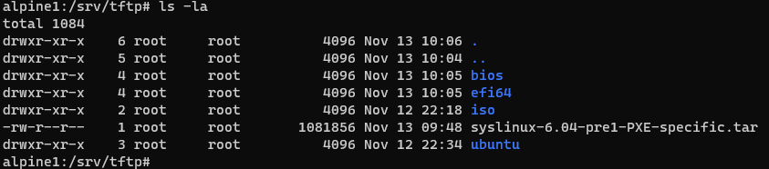

# `alpine1` setup and configuration.

## Setup boot files for `PXELINUX`

The boot files are separated by the type of Boot process `BIOS` and `EFI`
Take note the files while have duplicate names, there are separate versions for `BIOS` and `EFI`.

## TFTP Directory and content

- **(/srv/tftp/bios)**
`pxelinux.0`
`ldlinux.c32`
`menu.c32`
`libutil.c32`
`vesamenu.c32`
`libcom32.c32`
`pxelinux.cfg\default`
- **(/srv/tftp/efi64)**
`ldlinux.e64`
`syslinux.efi`
`menu.c32`
`libutil.c32`
`vesamenu.c32`
`libcom32.c32`
`pxelinux.cfg\default`

#### SYSLINUX files.

To extract the relevant files can be quite an effort to explain, I have compiled the required files.

[syslinux-6.04-pre1-PXE-specific.tar](./syslinux-files/syslinux-6.04-pre1-PXE-specific.tar)


#### Copy files to tftp folder.
The folder configure in the DHCP is `efi64/syslinux.efi` and `bios/pxelinux.0` this is with the `tftp` as the root folder.
```
# Download file
wget https://<URL>/syslinux-6.04-pre1-PXE-specific.tar

#extract file 
tar --strip-components=1 -xvf syslinux-6.04-pre1-PXE-specific.tar -C /srv/tftp
```

#### Validate
```
ls /srv/tftp/syslinux-6.04-pre1-PXE-specific
```
Here is the tftp folder after extraction. Take note of the the `EFI64` and `BIOS` folders



## Next step

We will proceed with the preparation of the OS boot files.
Continue with 
# [111-alpine1-setup-boot-files-part3-OS](./111-alpine1-setup-boot-files-part3-OS.md)
