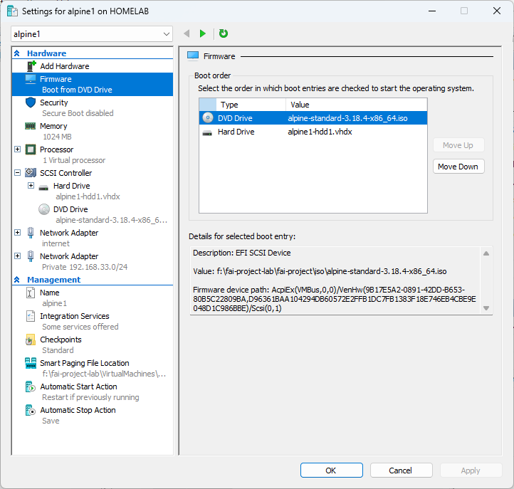
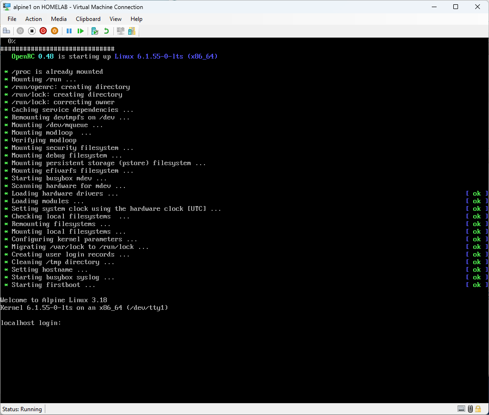

#Setup Alpine Load balancer

Setup-alpine 


| hostname | IP address |
| ----------- | ----------- |
| alpineLB | 192.168.33.201/24 |


## Install alpine

#### Key information
```
Alpine Default login
login : root
password : blank
```
## Hyper-V configuration for reference



## Alpine install ISO first boot



#### Disable IPv6 on Alpine 
In my setup IPv6 was not workinging if you have issues with IPv6, do disable before proceeding.

 Edit the /etc/sysctl.conf

```
vi /etc/sysctl.conf
# Manualy type in the following
# press [i] to be in insert /edit mode

net.ipv6.conf.all.disable_ipv6 = 1
# to save and exit following key press
# [esc] :x! [enter]

# reload the configuration
sysctl -p
```
After logging on at the prompt type 
``` 
setup-alpine
``` 
You will be asked a series of questions . I have listed my selection.
```
Keyboard Layout : [us]
Keyboard variant : [us]
Hostname : [alpinelb]
Network :
eth0: [dhcp]  # Internet connection
eth1: [192.168.33.201/24]
gateway: [none]
password : [abc123]
DNS Servers : k8s.lab
Timezone :[Singpore]
Proxy :[none]
ntp: default [chrony]  #if it takes long to complete , make sure ipv6 is disabled
Mirror :[f] # Detect and add fastest mirror
setup user : [no]
Which ssh server? [openssh]
allow root ssh login: [yes]
Allow ssh login : [yes]
Which disks would you like to use : [sda]
Disk Mode How would you like to use it ? [sys]
Erase the above disks and continue? [y]
```


## Install Docker on alpine.

Ensure community repository is enabled.
```
/etc/apk/repositories
#/media/cdrom/apks
http://dl-cdn.alpinelinux.org/alpine/v3.16/main
http://dl-cdn.alpinelinux.org/alpine/v3.16/community
```

## add and update docker 
```
apk update
apk add docker docker-compose
rc-update add docker boot
service docker start
#restarted VM. 
# had errors like 
alpinelb:~# service docker start -v
 * Executing: /lib/rc/sh/openrc-run.sh /lib/rc/sh/openrc-run.sh /etc/init.d/docker start
 * Starting Docker Daemon ...
 * supervise-daemon: fopen `/var/run/supervise-docker.pid': No such file or directory
 * Detaching to start `/usr/bin/dockerd'
# restart resolved the issues.

docker pull nginx:1.14
```
grep docker /var/log/messages | tail -100
```
/etc/nginx.conf

events{}
http {
    server {
        listen         8080;
		location /nginx_status{
		stub_status;
		}
        #return 301 https://$host$request_uri;
    }
}

stream {
    upstream k8s_servers {
        least_conn;
		server 192.168.33.201:6443 max_fails=2 fail_timeout=5s;
		server 192.168.33.202:6443 max_fails=2 fail_timeout=5s;
		server 192.168.33.203:6443 max_fails=2 fail_timeout=5s;
    }
    server {
        listen     6443;
        proxy_pass k8s_servers;
	    }
	server {
        listen     443;
        proxy_pass k8s_servers;
	    }
}

```
Run nginx docker
```
docker run -d --restart=unless-stopped \
  -p 6443:6443 -p 443:443 \
  -v /etc/nginx.conf:/etc/nginx/nginx.conf \
  nginx:1.14
```

## Docker commands
```
# list images
alpinelb:~# docker image ls
REPOSITORY   TAG       IMAGE ID       CREATED       SIZE
nginx        1.14      295c7be07902   4 years ago   109MB


# list running containers
alpinelb:~# docker container list
CONTAINER ID   IMAGE        COMMAND                  CREATED              STATUS                          PORTS     NAMES
d1de2693d20c   nginx:1.14   "nginx -g 'daemon of…"   About a minute ago   Restarting (1) 46 seconds ago             peaceful_lichterman

# stop container
docker stop d1de2693d20c

# check container logs
alpinelb:~# docker logs f874545d6662
2023/11/06 02:26:47 [emerg] 1#1: no "events" section in configuration
nginx: [emerg] no "events" section in configuration
2023/11/06 02:26:49 [emerg] 1#1: no "events" section in configuration
nginx: [emerg] no "events" section in configuration

```


##